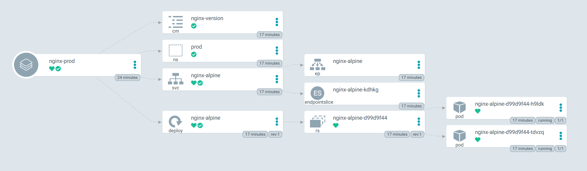

## Deploy multiple Nginx applications using Helm chart (same template and multiple input files)

### The folder contains the following code:
```bash
.
│   .gitignore
│   README.md
│   Vagrantfile
│
├───argocd
│       argocd-helm-nginx-prod.yaml
│       argocd-helm-nginx-staging.yaml
│
└───helm
    └───nginx-deployment
        │   Chart.yaml
        │   values-prod.yaml
        │   values-staging.yaml
        │   values.yaml
        │
        └───templates
                configmap.yaml
                deployment.yaml
                namespace.yaml
                service.yaml
```

### Create ArgoCD application nginx-staging:

```bash
kubectl apply -f argocd-helm-nginx-staging.yaml
```

### Create ArgoCD application nginx-prod:

```bash
kubectl apply -f argocd-helm-nginx-prod.yaml
```

### ArgoCD UI




**Note**: the specified `config.vm.box_version` in the Vagrantfile updates with time. You will have to change it from `212` shown in the demo video above to a newer version. When a particular version used in Vagrantfile becomes deprecated, the command prompt will show you all available newer versions. 


